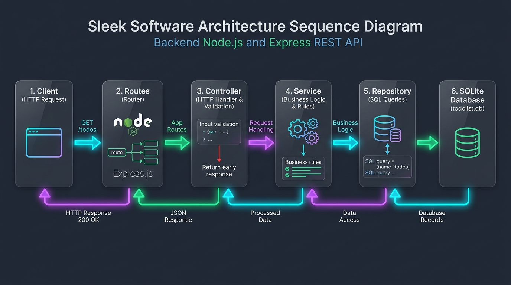
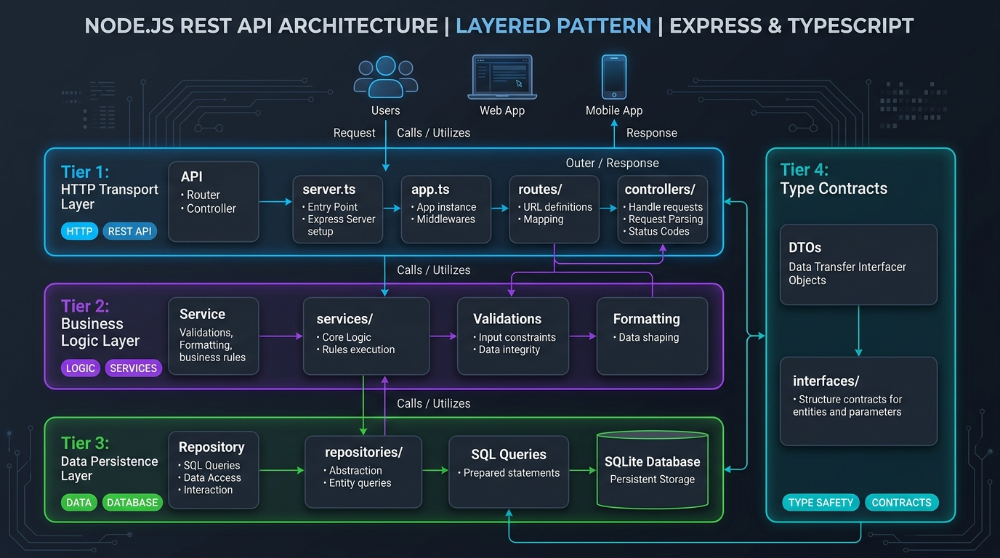
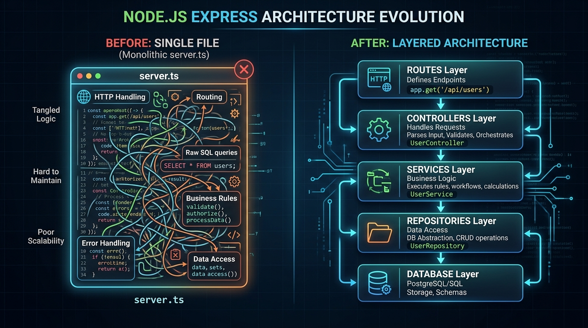

# 🏛️ Guia de Arquitetura em Camadas (Express + TypeScript)

> Este guia foi feito para ser aberto em aula e lido junto com a turma, demonstrando o passo a passo da evolução de um código em arquivo único (*main*) para uma **Arquitetura em Camadas limpa, profissional e didática**.

---

## 🎯 1. Por que organizar em camadas?

### O que tínhamos na `main`?
Todo o código da API estava dentro de um único arquivo: `src/server.ts` (~120 linhas).
Ele fazia **tudo ao mesmo tempo**:
1. Lia variáveis de ambiente (`dotenv`).
2. Criava a instância do Express e registrava middlewares.
3. Declarava interfaces TypeScript.
4. Definia endpoints e rotas HTTP (`/tarefas`).
5. Validava se o corpo da requisição veio preenchido.
6. Escrevia e executava queries SQL no banco SQLite (`db.prepare(...)`).
7. Gerenciava status codes HTTP (`200`, `201`, `400`, `404`, `204`).
8. Subia o servidor na porta com `app.listen`.

### O problema do "Arquivo Único"
Enquanto o projeto tem apenas 4 rotas de tarefas, tudo cabe em 120 linhas. Mas e quando o sistema tiver:
* Usuários, Autenticação, Categorias, Tags, Relatórios?
* Um arquivo com 3.000 linhas onde 5 pessoas mexem ao mesmo tempo, gerando conflitos no Git a cada *pull request*?
* Se decidirmos trocar o SQLite pelo **Prisma ORM** (Fase 3), teremos que caçar comandos SQL no meio de regras de Express!

---

## 🍽️ 2. A Analogia do Restaurante

Para memorizar a função de cada camada, pense em um **restaurante**:

```text
 🧑‍💻 Cliente (Insomnia / Postman / React)
     │
     ▼
 📋 Cardápio (Routes)
     │  "Mostra quais pratos podem ser pedidos e para onde levar"
     ▼
 🤵 Garçom (Controller)
     │  "Recebe o cliente, anota o pedido (req), entrega o prato (res) e dá a conta (status code)"
     ▼
 👨‍🍳 Chef de Cozinha (Service)
     │  "Aplica as regras: tempera, monta a receita, decide se o pedido é válido"
     ▼
 🥫 Despensa / Estoquista (Repository)
     │  "Guarda e busca os ingredientes na prateleira física (banco de dados SQLite)"
     ▼
 🗄️ Prateleira Física (Banco todolist.db)
```

---

## 🔄 3. O Fluxo de uma Requisição

Veja o ciclo de vida completo quando alguém faz um `POST /tarefas`:



```text
 🧑‍💻 CLIENTE                 📋 ROUTES                 🤵 CONTROLLER               👨‍🍳 SERVICE                🥫 REPOSITORY              🗄️ SQLITE (todolist.db)
   │                         │                         │                         │                         │                         │
   │ 1. POST /tarefas        │                         │                         │                         │                         │
   │────────────────────────▶│                         │                         │                         │                         │
   │                         │ 2. criarTarefa(req, res)│                         │                         │                         │
   │                         │────────────────────────▶│                         │                         │                         │
   │                         │                         │ 3. Valida entrada:      │                         │                         │
   │                         │                         │    - body tem título?   │                         │                         │
   │                         │                         │    - título é vazio?    │                         │                         │
   │                         │                         │                         │                         │                         │
   │                         │                         │ 4. criarTarefa(titulo)  │                         │                         │
   │                         │                         │────────────────────────▶│                         │                         │
   │                         │                         │                         │ 5. Regra de Negócio:    │                         │
   │                         │                         │                         │    criadoEm = ISOString │                         │
   │                         │                         │                         │                         │                         │
   │                         │                         │                         │ 6. criar(titulo, data)  │                         │
   │                         │                         │                         │────────────────────────▶│                         │
   │                         │                         │                         │                         │ 7. INSERT INTO tarefas  │
   │                         │                         │                         │                         │────────────────────────▶│
   │                         │                         │                         │                         │                         │
   │                         │                         │                         │                         │ 8. Registro inserido    │
   │                         │                         │                         │                         │◀────────────────────────│
   │                         │                         │                         │ 9. Retorna Tarefa       │                         │
   │                         │                         │                         │◀────────────────────────│                         │
   │                         │                         │ 10. Retorna Tarefa      │                         │                         │
   │                         │                         │◀────────────────────────│                         │                         │
   │ 11. HTTP 201 Created    │                         │                         │                         │                         │
   │     + JSON da Tarefa    │                         │                         │                         │                         │
   │◀──────────────────────────────────────────────────│                         │                         │                         │
```

---

## 🧩 4. O Mapa das Camadas



```text
┌────────────────────────────────────────────────────────────────────────────────────────┐
│                                 🧑‍💻 CLIENTE HTTP                                        │
│                        (Insomnia, Postman, Frontend React)                             │
└───────────────────────────────────────────┬────────────────────────────────────────────┘
                                            │ Requisição HTTP (GET, POST, PUT, DELETE)
                                            ▼
┌────────────────────────────────────────────────────────────────────────────────────────┐
│                               CAMADA DE TRANSPORTE HTTP                                │
│                                                                                        │
│   src/server.ts ──────────▶ Lê a PORT do .env e inicia o servidor (app.listen)         │
│         │                                                                              │
│         ▼                                                                              │
│   src/app.ts ─────────────▶ Configura Express, express.json() e registra as rotas      │
│         │                                                                              │
│         ▼                                                                              │
│   src/routes/tarefas.routes.ts ──▶ Mapeia URLs e verbos HTTP:                          │
│                                    GET  /          ──▶ listarTarefas                   │
│                                    GET  /:id       ──▶ buscarTarefaPorId               │
│                                    POST /          ──▶ criarTarefa                     │
│                                    PUT  /:id       ──▶ atualizarTarefa                 │
│                                    DELETE /:id     ──▶ deletarTarefa                   │
│         │                                                                              │
│         ▼                                                                              │
│   src/controllers/tarefas.controller.ts ──▶ Garçom:                                    │
│                                             - Recebe (req: Request)                    │
│                                             - Valida dados de entrada (400)            │
│                                             - Chama o Service                          │
│                                             - Responde (res: Response) (200, 201, 204) │
└───────────────────────────────────────────┬────────────────────────────────────────────┘
                                            │ Chama funções em TypeScript
                                            ▼
┌────────────────────────────────────────────────────────────────────────────────────────┐
│                               CAMADA DE REGRAS DE NEGÓCIO                              │
│                                                                                        │
│   src/services/tarefas.service.ts ────────▶ Chef de Cozinha:                           │
│                                             - Não conhece req, res nem SQL             │
│                                             - Gera criadoEm (data atual em ISO)        │
│                                             - Mescla dados antigos com novos (??)      │
│                                             - Checa se o registro existe               │
└───────────────────────────────────────────┬────────────────────────────────────────────┘
                                            │ Chama funções de banco
                                            ▼
┌────────────────────────────────────────────────────────────────────────────────────────┐
│                                CAMADA DE PERSISTÊNCIA / BANCO                          │
│                                                                                        │
│   src/repositories/tarefas.repository.ts ─▶ Despensa / Estoquista:                     │
│                                             - Escreve e executa os comandos SQL        │
│                                             - db.prepare("SELECT * FROM tarefas")      │
│                                             - db.prepare("INSERT INTO tarefas...")     │
│                                             - db.prepare("UPDATE tarefas SET...")      │
│                                             - db.prepare("DELETE FROM tarefas...")     │
│         │                                                                              │
│         ▼                                                                              │
│   src/banco.ts ───────────────────────────▶ Conecta no todolist.db e roda schema.sql   │
│         │                                                                              │
│         ▼                                                                              │
│   todolist.db ────────────────────────────▶ Arquivo físico do SQLite no disco          │
└────────────────────────────────────────────────────────────────────────────────────────┘

┌────────────────────────────────────────────────────────────────────────────────────────┐
│                              CONTRATOS GLOBAIS (TIPAGEM)                               │
│                                                                                        │
│   src/types/tarefa.ts ────────────────────▶ Tarefa, CriarTarefaDTO, AtualizarTarefaDTO │
│                                             (Importado por Controller, Service e Repo) │
└────────────────────────────────────────────────────────────────────────────────────────┘
```

---

## ⚖️ 4.1. Antes vs Depois (A Lição de Arquitetura)



```text
   ANTES (Branch main):
   ┌─────────────────────────────────────────────────────────┐
   │                       src/server.ts                     │
   │  [Express + Rotas + Regras + SQL SQLite + app.listen]   │
   │                   (TUDO MISTURADO)                      │
   └─────────────────────────────────────────────────────────┘

   DEPOIS (Branch refactor/organizacao-camadas):
   ┌───────────────────────────┐
   │       src/server.ts       │ ──▶ Só liga o servidor na porta
   └─────────────┬─────────────┘
                 ▼
   ┌───────────────────────────┐
   │         src/app.ts        │ ──▶ Só configura o Express e middlewares
   └─────────────┬─────────────┘
                 ▼
   ┌───────────────────────────┐
   │ src/routes/tarefas...     │ ──▶ Só mapeia URLs e verbos HTTP
   └─────────────┬─────────────┘
                 ▼
   ┌───────────────────────────┐
   │ src/controllers/tarefas...│ ──▶ Só trata HTTP (req, res, status codes)
   └─────────────┬─────────────┘
                 ▼
   ┌───────────────────────────┐
   │ src/services/tarefas...   │ ──▶ Só cuida das regras e validações
   └─────────────┬─────────────┘
                 ▼
   ┌───────────────────────────┐
   │ src/repositories/tarefas..│ ──▶ Só executa SQL no SQLite
   └─────────────┬─────────────┘
                 ▼
   ┌───────────────────────────┐
   │       todolist.db         │ ──▶ Banco físico SQLite
   └───────────────────────────┘
```

> 💡 **Pergunta de Ouro para fazer aos alunos:**  
> *"Quando formos para a **Fase 3 (Prisma ORM)**, qual caixinha muda?"*  
> **Resposta:** Apenas a caixinha `src/repositories/tarefas.repository.ts`! O Controller, o Service e as Rotas continuarão exatamente iguais. Essa é a lição do desacoplamento!

---

## 🪜 5. Passo a Passo da Refatoração (da `main` para as Camadas)

Se você estiver na branch `main` e quiser construir essa estrutura do zero, siga estes **6 passos**:

### Passo 0: Criar uma nova branch
Nunca faça refatorações grandes direto na branch principal:
```bash
git checkout -b refactor/organizacao-camadas
```

---

### Passo 1: Isolar Contratos e Tipos (`src/types/tarefa.ts`)
Tire as interfaces que estavam soltas no `server.ts` e crie um arquivo dedicado.

* **O que colocar lá:** A interface da entidade `Tarefa` e os DTOs (*Data Transfer Objects*) de entrada.
* **Arquivo:** `src/types/tarefa.ts`

```typescript
export interface Tarefa {
  id: number;
  titulo: string;
  feito: number;
  criadoEm: string;
}

export interface CriarTarefaDTO {
  titulo?: string | undefined;
}

export interface AtualizarTarefaDTO {
  titulo?: string | undefined;
  feito?: number | undefined;
}
```

> **Por que é bom?** Qualquer camada que precisar saber o formato de uma tarefa importa desse arquivo único.

---

### Passo 2: Criar o Repository (`src/repositories/tarefas.repository.ts`)
Tire **todas as queries SQL** (`db.prepare(...)`) do `server.ts` e coloque aqui.

* **Responsabilidade:** Apenas falar com o banco de dados.
* **Regra de ouro:** Não pode ter `req`, `res`, nem status codes HTTP aqui dentro.

```typescript
import { db } from "../banco.js";
import type { Tarefa } from "../types/tarefa.js";

export function buscarTodas(): Tarefa[] {
  return db.prepare("SELECT * FROM tarefas").all() as Tarefa[];
}

export function buscarPorId(id: number): Tarefa | undefined {
  return db.prepare("SELECT * FROM tarefas WHERE id = ?").get(id) as Tarefa | undefined;
}

export function criar(titulo: string, criadoEm: string): Tarefa {
  return db
    .prepare("INSERT INTO tarefas (titulo, criadoEm) VALUES (?, ?) RETURNING *")
    .get(titulo, criadoEm) as Tarefa;
}

export function atualizar(id: number, titulo: string, feito: number): Tarefa {
  return db
    .prepare("UPDATE tarefas SET titulo = ?, feito = ? WHERE id = ? RETURNING *")
    .get(titulo, feito, id) as Tarefa;
}

export function deletar(id: number): void {
  db.prepare("DELETE FROM tarefas WHERE id = ?").run(id);
}
```

> **A Lição da Mentoria:** Quando chegarmos na **Fase 3 (Prisma)**, adivinhe qual arquivo será alterado? **Apenas este!** O restante do sistema continuará funcionando sem saber que o banco mudou.

---

### Passo 3: Criar o Service (`src/services/tarefas.service.ts`)
O Service orquestra as regras da aplicação. Ele não sabe o que é Express (nem `req`, nem `res`), mas sabe como as tarefas devem se comportar.

* **Responsabilidade:** Regras de negócio, formatação de datas, checagem de existência antes de alterar ou apagar.
* **Arquivo:** `src/services/tarefas.service.ts`

```typescript
import * as tarefaRepository from "../repositories/tarefas.repository.js";
import type { Tarefa, AtualizarTarefaDTO } from "../types/tarefa.js";

export function listarTarefas(): Tarefa[] {
  return tarefaRepository.buscarTodas();
}

export function buscarTarefaPorId(id: number): Tarefa | undefined {
  return tarefaRepository.buscarPorId(id);
}

export function criarTarefa(titulo: string): Tarefa {
  const criadoEm: string = new Date().toISOString();
  return tarefaRepository.criar(titulo, criadoEm);
}

export function atualizarTarefa(id: number, dados: AtualizarTarefaDTO): Tarefa | undefined {
  const tarefaExistente: Tarefa | undefined = tarefaRepository.buscarPorId(id);
  if (!tarefaExistente) {
    return undefined;
  }

  const tituloFinal: string = dados.titulo ?? tarefaExistente.titulo;
  const feitoFinal: number = dados.feito ?? tarefaExistente.feito;

  return tarefaRepository.atualizar(id, tituloFinal, feitoFinal);
}

export function deletarTarefa(id: number): boolean {
  const tarefaExistente: Tarefa | undefined = tarefaRepository.buscarPorId(id);
  if (!tarefaExistente) {
    return false;
  }

  tarefaRepository.deletar(id);
  return true;
}
```

---

### Passo 4: Criar o Controller (`src/controllers/tarefas.controller.ts`)
O Controller é a "porta de entrada" das requisições HTTP.

* **Responsabilidade:** Ler parâmetros (`req.params`, `req.body`), validar formatos de entrada, chamar o `service` e responder com o código HTTP adequado (`200`, `201`, `204`, `400`, `404`).
* **Arquivo:** `src/controllers/tarefas.controller.ts`

```typescript
import type { Request, Response } from "express";
import type { Tarefa, CriarTarefaDTO, AtualizarTarefaDTO } from "../types/tarefa.js";
import * as tarefasService from "../services/tarefas.service.js";

export function listarTarefas(req: Request, res: Response): void {
  const tarefas: Tarefa[] = tarefasService.listarTarefas();
  res.json(tarefas);
}

export function buscarTarefaPorId(req: Request<{ id: string }>, res: Response): void {
  const idTarefa: number = Number(req.params.id);
  const tarefaProcurada: Tarefa | undefined = tarefasService.buscarTarefaPorId(idTarefa);

  if (!tarefaProcurada) {
    res.status(404).send();
    return;
  }

  res.json(tarefaProcurada);
}

export function criarTarefa(req: Request<{}, {}, CriarTarefaDTO>, res: Response): void {
  const titulo: string | undefined = req.body.titulo;

  if (!titulo) {
    res.status(400).json("O título não foi enviado");
    return;
  }

  const tituloFormatado: string = titulo.trim();
  if (!tituloFormatado) {
    res.status(400).json("O título não pode ser vazio");
    return;
  }

  const novaTarefa: Tarefa = tarefasService.criarTarefa(tituloFormatado);
  res.status(201).json(novaTarefa);
}

export function atualizarTarefa(req: Request<{ id: string }, {}, AtualizarTarefaDTO>, res: Response): void {
  const idTarefa: number = Number(req.params.id);
  const { titulo, feito }: AtualizarTarefaDTO = req.body;

  const tarefaAtualizada: Tarefa | undefined = tarefasService.atualizarTarefa(idTarefa, { titulo, feito });
  if (!tarefaAtualizada) {
    res.status(404).send();
    return;
  }

  res.json(tarefaAtualizada);
}

export function deletarTarefa(req: Request<{ id: string }>, res: Response): void {
  const idTarefa: number = Number(req.params.id);
  const foiDeletado: boolean = tarefasService.deletarTarefa(idTarefa);

  if (!foiDeletado) {
    res.status(404).send();
    return;
  }

  res.status(204).send();
}
```

---

### Passo 5: Criar as Rotas (`src/routes/tarefas.routes.ts`)
Conecta os caminhos da URL com os métodos do Controller usando o `Router` do Express.

* **Arquivo:** `src/routes/tarefas.routes.ts`

```typescript
import { Router } from "express";
import {
  listarTarefas,
  buscarTarefaPorId,
  criarTarefa,
  atualizarTarefa,
  deletarTarefa,
} from "../controllers/tarefas.controller.js";

const router: Router = Router();

router.get("/", listarTarefas);
router.get("/:id", buscarTarefaPorId);
router.post("/", criarTarefa);
router.put("/:id", atualizarTarefa);
router.delete("/:id", deletarTarefa);

export default router;
```

---

### Passo 6: Desacoplar `app.ts` e `server.ts`
Boa prática profissional: separar a **configuração do Express** da **inicialização do servidor**.

#### `src/app.ts` (Configuração)
```typescript
import express, { type Application } from "express";
import tarefasRoutes from "./routes/tarefas.routes.js";

const app: Application = express();

app.use(express.json());
app.use("/tarefas", tarefasRoutes);

export default app;
```

#### `src/server.ts` (Ligar a tomada)
```typescript
import dotenv from "dotenv";
import app from "./app.js";

dotenv.config();

const PORT: number = Number(process.env.PORT) || 3000;

app.listen(PORT, (): void => {
  console.log(`Server running on port ${PORT}`);
});
```

> **Por que separar `app` de `server`?**
> Se no futuro quisermos rodar **testes automatizados** (ex: com Jest ou Supertest), nós importamos apenas o `app` sem precisar subir o servidor na porta de verdade!

---

## ❓ 6. Perguntas Frequentes dos Alunos (FAQ)

### 1. "Por que escrevemos `.js` no import se o arquivo é `.ts`?"
* O Node.js moderno usa **ESM** (`"type": "module"` no `package.json`).
* No ESM oficial, toda importação precisa ter a extensão explícita do arquivo final.
* Como o código compilado final que roda no Node será `.js`, o TypeScript exige que você aponte para o arquivo `.js`. Ele sabe localizar o `.ts` correspondente em desenvolvimento.

### 2. "Por que nomear `tarefas.service.ts` e não `tarefasService.ts`?"
* **Evita bugs de maiúsculas/minúsculas:** Sistemas Linux (servidores e GitHub) diferenciam maiúsculas de minúsculas, enquanto Windows/Mac não. Usar tudo em minúsculo com ponto elimina inconsistências.
* **Busca no editor (`Ctrl + P`):** Você pode digitar `.service` ou `.controller` e o VS Code lista exatamente os arquivos daquela camada.

### 3. "Não é código demais só para um To-Do list?"
* Para uma To-Do list de 4 rotas, pode parecer muito. Mas **arquitetura não é feita para o tamanho que o sistema tem hoje, e sim para o tamanho que ele terá amanhã**.
* Com essa estrutura, adicionar novas entidades (como `usuarios`, `projetos`, `etiquetas`) segue exatamente a mesma receita de bolo, mantendo o projeto organizado para sempre.

---

## 🚀 7. Como Testar
No terminal:
```bash
npm run dev
```

E em outro terminal, teste com `curl`:
```bash
# 1. Listar tarefas
curl -i http://localhost:3000/tarefas

# 2. Criar uma tarefa
curl -i -X POST http://localhost:3000/tarefas \
  -H "Content-Type: application/json" \
  -d '{"titulo": "Aprender Arquitetura em Camadas"}'

# 3. Buscar por ID
curl -i http://localhost:3000/tarefas/1

# 4. Atualizar tarefa (marcar como feita)
curl -i -X PUT http://localhost:3000/tarefas/1 \
  -H "Content-Type: application/json" \
  -d '{"feito": 1}'

# 5. Deletar tarefa
curl -i -X DELETE http://localhost:3000/tarefas/1
```
